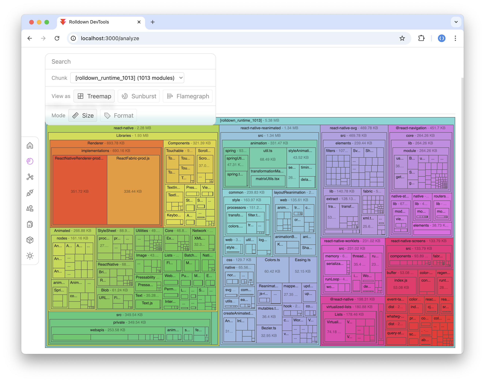
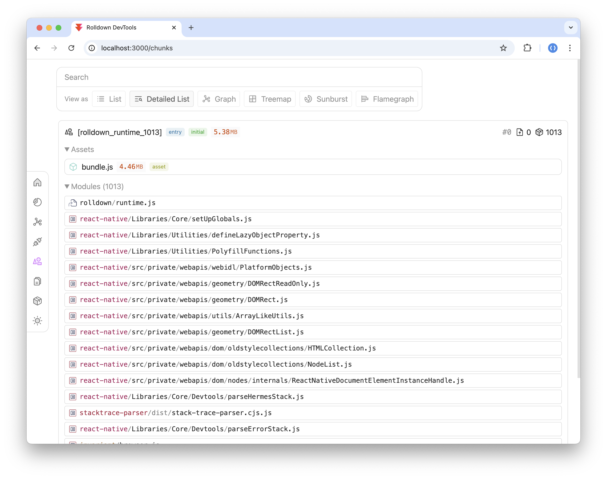
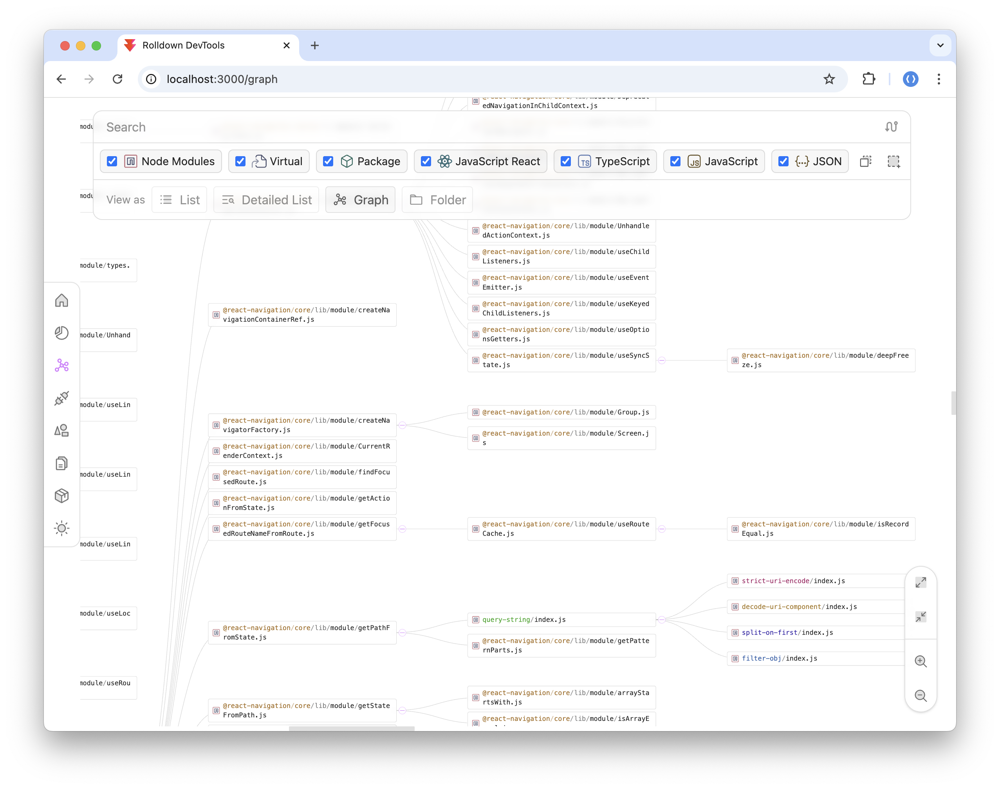
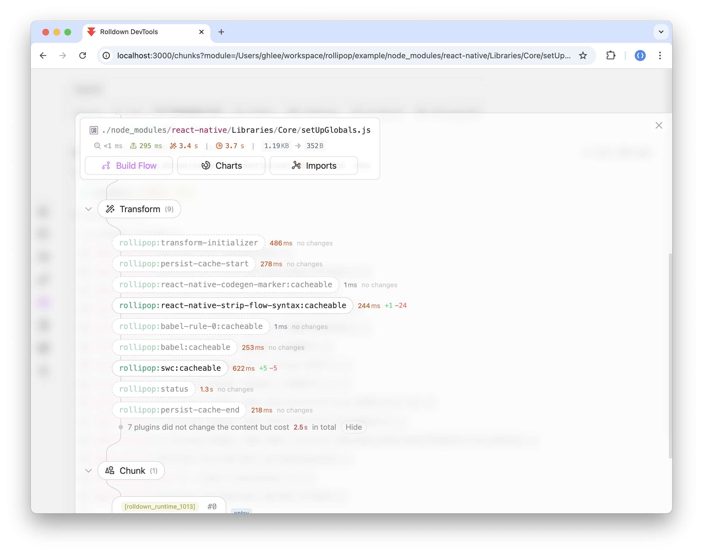
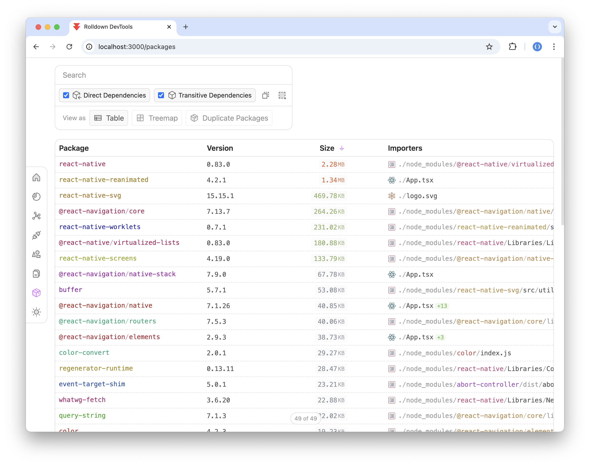

# Rolldown Analyzer

Standalone Analyzer for Rolldown

> [!IMPORTANT]
> This project is still in development.

## Preview

[Live Demo](https://rolldown-analyzer.vercel.app)











## Usage

```bash
# npm
npm install rolldown-analyzer

# pnpm
pnpm install rolldown-analyzer

# yarn
yarn add rolldown-analyzer
```

### Configure Rolldown

Enable the DevTools integration in your Rolldown build configuration:

```ts
import * as rolldown from 'rolldown';

const buildOptions: rolldown.BuildOptions = {
  devtools: {}, // Enable DevTools integration
  // ...
};

await rolldown.build(buildOptions);
```

When DevTools is enabled, Rolldown generates the following files that the analyzer uses to build its views:

- `node_modules/.rolldown/<session_id>/meta.json`
- `node_modules/.rolldown/<session_id>/logs.json`

### Generate Analyze Report

Use `generateTemplate` to produce a standalone analysis page:

```ts
import { generateTemplate } from 'rolldown-analyzer';

await generateTemplate({
  logsPath: 'node_modules/.rolldown/<session_id>/logs.json',
  metaPath: 'node_modules/.rolldown/<session_id>/meta.json',
  outDir: './report',
});
```

This copies the built frontend files and a generated `rolldown-data.json` into the output directory. You can then serve it with any static file server:

```bash
npx serve ./report
```

### CLI

You can also use the analyzer from the command line:

```bash
# Generate a standalone analysis page
npx rolldown-analyzer generate \
  --logs node_modules/.rolldown/<session_id>/logs.json \
  --meta node_modules/.rolldown/<session_id>/meta.json \
  -o ./report

# Generate only the JSON data
npx rolldown-analyzer generate-data \
  --logs node_modules/.rolldown/<session_id>/logs.json \
  --meta node_modules/.rolldown/<session_id>/meta.json \
  -o ./data.json
```

### `generateData`

If you only need the raw data without the frontend, use `generateData` instead:

```ts
import { generateData } from 'rolldown-analyzer';

const data = await generateData({
  logsPath: 'node_modules/.rolldown/<session_id>/logs.json',
  metaPath: 'node_modules/.rolldown/<session_id>/meta.json',
});
```

## Licenses

This project is licensed under the [MIT License](LICENSE).

### Acknowledgments

This project is a derivative work based on the original implementation by [vitejs/devtools](https://github.com/vitejs/devtools).
