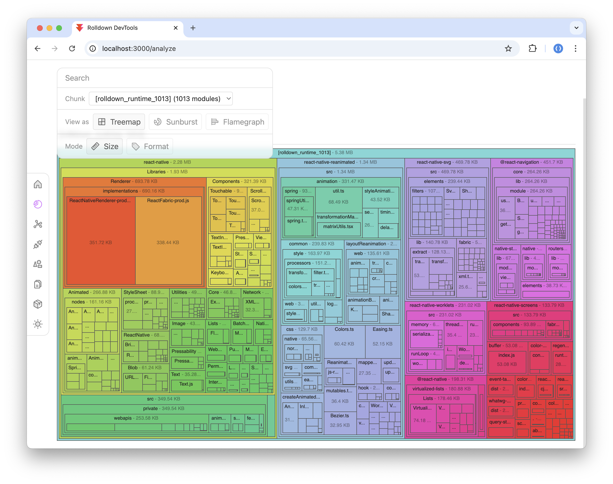
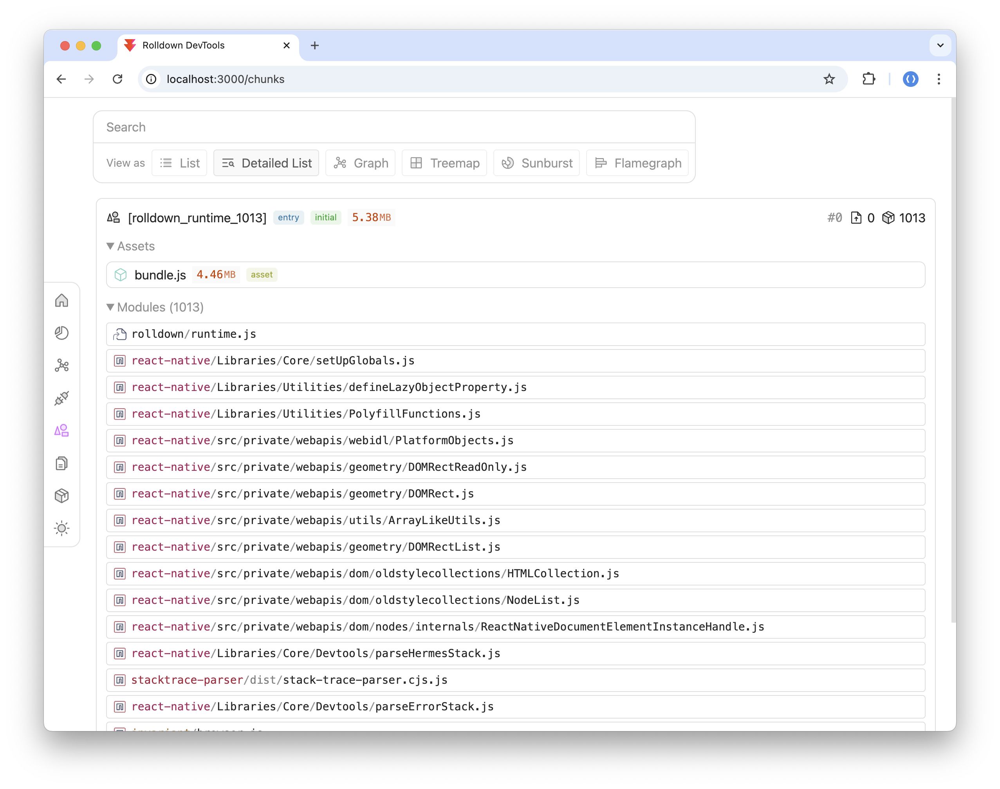
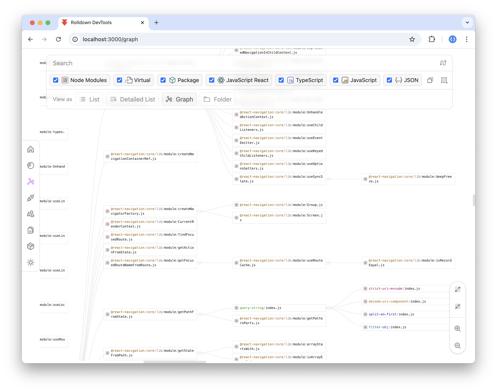
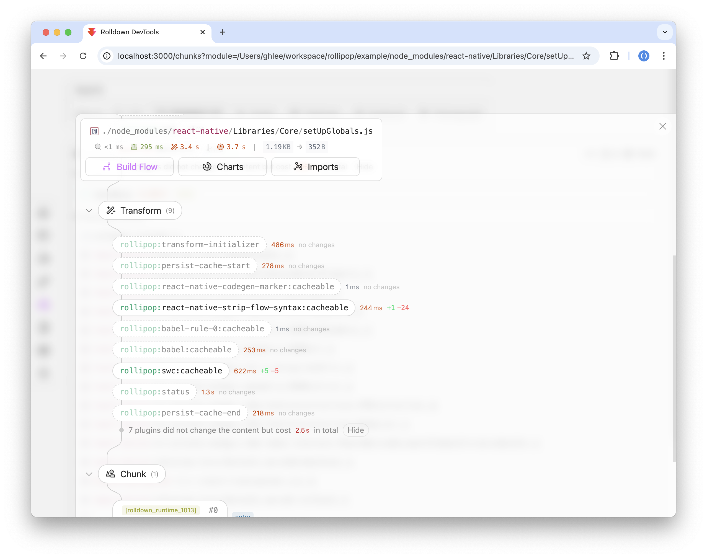
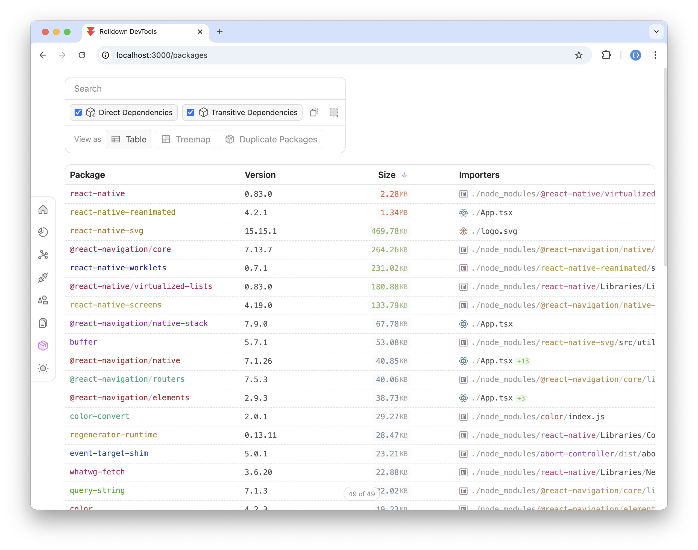
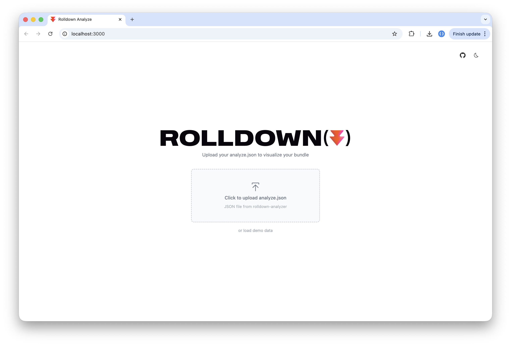
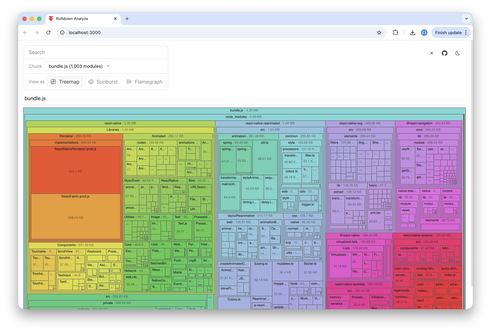

# Rolldown Analyzer

Standalone Analyzer for Rolldown

## Preview

**Full Template**

[Live Demo](https://rolldown-analyzer.vercel.app)











---

**Lite Template**

[Live Demo](https://leegeunhyeok.github.io/rolldown-analyzer/)





## Installation

```bash
# npm
npm install rolldown-analyzer

# pnpm
pnpm install rolldown-analyzer

# yarn
yarn add rolldown-analyzer
```

## Usage

There are two template types available:

- **Full Template**: Based on Rolldown DevTools integration (`logs.json` + `meta.json`). Provides rich information including module details, plugin metrics, module graph, chunks, assets, and package analysis. Generated as a multi-file static site.
- **Lite Template**: Based on Rolldown experimental `bundleAnalyzerPlugin` (`analyze-data.json`). Focused on bundle visualization. Generated as a **single HTML file** with all assets inlined.

### CLI

You can also use the analyzer from the command line:

```bash
# Full template
npx rolldown-analyzer generate -t full \
  --logs node_modules/.rolldown/<session_id>/logs.json \
  --meta node_modules/.rolldown/<session_id>/meta.json \
  -o ./report

# Lite template
npx rolldown-analyzer generate -t lite \
  --data ./bundle-analysis.json \
  -o ./report

# Generate only the JSON data (without template)
npx rolldown-analyzer generate-data \
  --logs node_modules/.rolldown/<session_id>/logs.json \
  --meta node_modules/.rolldown/<session_id>/meta.json \
  -o ./data.json
```

### Full Template

#### Configure Rolldown

Enable the DevTools integration in your Rolldown build configuration:

```ts
import * as rolldown from 'rolldown';

const buildOptions: rolldown.BuildOptions = {
  devtools: {}, // Enable DevTools integration
  // ...
};

await rolldown.build(buildOptions);
```

When DevTools is enabled, Rolldown generates the following files that the analyzer uses to build its views:

- `node_modules/.rolldown/<session_id>/meta.json`
- `node_modules/.rolldown/<session_id>/logs.json`

#### Generate Analyze Report

Use `generateDevtools` to produce a standalone analysis page:

```ts
import { generateDevtools } from 'rolldown-analyzer';

await generateDevtools({
  logsPath: 'node_modules/.rolldown/<session_id>/logs.json',
  metaPath: 'node_modules/.rolldown/<session_id>/meta.json',
  outDir: './report',
});
```

This copies the built frontend files and a generated `rolldown-data.json` into the output directory. You can then serve it with any static file server:

```bash
npx serve ./report
```

### Lite Template

#### Configure Rolldown

Use the experimental `bundleAnalyzerPlugin` in your Rolldown build configuration:

```ts
import * as rolldown from 'rolldown';
import { bundleAnalyzerPlugin } from 'rolldown/experimental';

const buildOptions: rolldown.BuildOptions = {
  plugins: [bundleAnalyzerPlugin()], // Defaults to `analyze-data.json`
  // ...
};

await rolldown.build(buildOptions);
```

This generates a `analyze-data.json` file that the analyzer uses.

#### Generate Analyze Report

Use `generateAnalyzer` to produce a single HTML report:

```ts
import { generateAnalyzer } from 'rolldown-analyzer';

generateAnalyzer({
  dataPath: './analyze-data.json',
  outDir: './report',
});
```

### APIs

#### `generateDevtools`

Generates a full template static site from DevTools data:

```ts
import { generateDevtools } from 'rolldown-analyzer';

await generateDevtools({
  logsPath: 'node_modules/.rolldown/<session_id>/logs.json',
  metaPath: 'node_modules/.rolldown/<session_id>/meta.json',
  outDir: './report',
});
```

#### `generateAnalyzer`

Generates a lite template single HTML file from analyzer data:

```ts
import { generateAnalyzer } from 'rolldown-analyzer';

generateAnalyzer({
  dataPath: './bundle-analysis.json',
  outDir: './report',
});
```

#### `generateData`

If you only need the raw data without the frontend, use `generateData` instead:

```ts
import { generateData } from 'rolldown-analyzer';

const data = await generateData({
  logsPath: 'node_modules/.rolldown/<session_id>/logs.json',
  metaPath: 'node_modules/.rolldown/<session_id>/meta.json',
});
```

## Licenses

This project is licensed under the [MIT License](LICENSE).

### Acknowledgments

This project is a derivative work based on the original implementation by [vitejs/devtools](https://github.com/vitejs/devtools).
